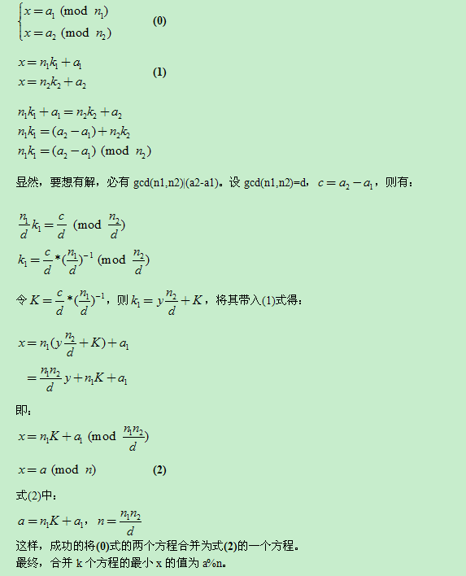

# 中国剩余定理
## CRT

$$
若有n个方程组 \\
x \equiv a_1(mod\;m_1) \\
x \equiv a_2(mod\;m_2) \\
\cdots \\
x \equiv a_n(mod\;m_n) \\
且m_i两两互质 \\
那么设M=\Pi_{i=1}^nm_i,n_i=\frac{M}{m_i}\\
计算n_i在(mod\;m_i)下的逆元n_i^{-1} \\
计算c_i=n_i*n_i^{-1} \\
解x=\sum_{i=1}^na_ic_i
$$

## 新方法
合并方程组
$$
有两个方程组 \\
x \equiv a_1(mod\;m_1) \\
x \equiv a_2(mod\;m_2) \\
那么设p,q使
x = m_1p+a_1=m_2q+a_2 \\
那么
m_1p-m_2q=a_2-a_1 \\
设
d=gcd(m_1,m_2) \\
若d\nmid(a_2-a_1)则无解 \\
否则可用extend\_gcd求出一组p,q \\
则方程组合并为 \\
x \equiv m_1p+a_1(mod\;lcm(m_1,m_2))
$$
### 代码
模板题Luogu4777

```c++
#include <cstdio>

long long read()
{
	char last = '+', ch = getchar();
	while (ch < '0' || ch > '9') last = ch, ch = getchar();
	long long tmp = 0;
	while (ch >= '0' && ch <= '9') tmp = tmp * 10 + ch - 48, ch = getchar();
	if (last == '-') tmp = -tmp;
	return tmp;
}

int n;
long long a1, m1, a2, m2;

long long mul(long long a, long long b, long long M)
{
	a = (a % M + M) % M;
	b = (b % M + M) % M;
	long long ans = 0;
	long long tmp = a;
	while (b)
	{
		if (b & 1)
		{
			ans = (ans + tmp) % M;
		}
		tmp = (tmp + tmp) % M;
		b >>= 1;
	}
	return ans;
}

long long extend_gcd(long long a, long long &x, long long b, long long &y)
{
	if (b == 0)
	{
		x = 1;
		y = 0;
		return a;
	}
	long long d = extend_gcd(b, x, a % b, y);
	long long t = x;
	x = y;
	y = t - a / b * y;
	return d;
}

void solve()
{
	long long x, y;
	long long d = extend_gcd(m1, x, m2, y);
	long long lcm = m1 / d * m2;
	a1 = ((mul(mul((a2 - a1) / d, m1, lcm), x, lcm) + a1) % lcm + lcm) % lcm;
	m1 = lcm;
}

int main()
{
	n = read();
	m1 = read();
	a1 = read();
	for (int i = 2; i <= n; i++)
	{
		m2 = read();
		a2 = read();
		solve();
	}
	printf("%lld\n", a1);
	return 0;
}
```
### 参考
[中国剩余定理](https://oi-wiki.org/math/crt/)


## （这方法很垃圾。。


